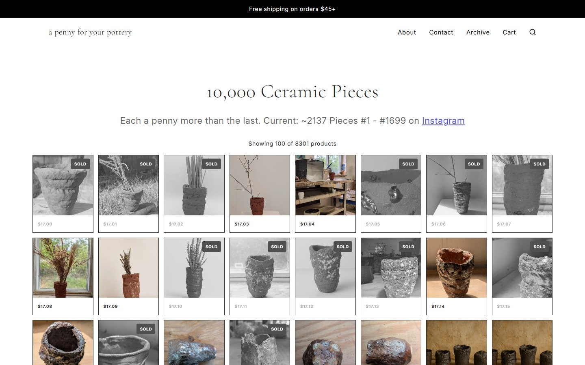

## The curiosity

I wanted to get better at clay by making a great deal of it, and I wanted the price of a pot to stop being a guess. So the whole thing got one rule: ten thousand pieces, numbered in order, each one cent more than the one before. Piece 1 cost a penny. Piece 10,000 will cost a hundred dollars.

## What it does

The rule does the pricing, the numbering does the record, and the record becomes an archive anyone can walk. A pot leaves the shelf and takes its number with it. Someone can own piece 412 and know exactly where it sits in the run, and what came before and after.

## The system

Pieces are made in small batches, photographed, numbered, and listed. The shop carries the listing; the archive carries the page. Every photographed piece has its own address, with its photographs, the day it was photographed, and a link to buy it. The ledger runs in number order, grouped by the day of photography, with hand-picked ranges through the number line.

## Cause and effect

A piece is photographed. By the time it is listed it has a number, a price, a page, and a place in the run, and the run is one cent longer.

- Piece 1, $0.01
- Piece 2,253, $22.53
- Piece 10,000, $100.00

The price of any piece is its number times a cent. No exceptions.

## What changed

Pricing stopped being a conversation. Collecting stays possible at every stage: the early pieces cost less than a stamp, and the late ones will cost what a good bowl costs. The work documents its own improvement, because repetition is visible in the number line. More than two thousand pieces in, it is a snapshot of where the work is, not a finished statement.

## Experience it

[Browse the pieces](https://apennyforyourpottery.com), or [walk the archive](https://archive.apennyforyourpottery.com), where every photographed piece has a page.
